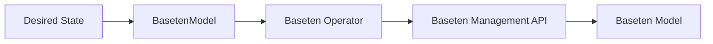

# Baseten Operator

[](https://github.com/abridgeai/baseten-operator/actions/workflows/test.yml)
[](https://goreportcard.com/report/github.com/abridgeai/baseten-operator)
[](LICENSE)

> **Note:** This project is a work in progress. The API is `v1alpha1` and may change between versions. If you run into issues, please [open a GitHub issue](https://github.com/abridgeai/baseten-operator/issues).

**A Kubernetes operator for managing ML models deployed on [Baseten](https://baseten.co).**

Define your model, environment, autoscaling, and promotion strategy as a `BasetenModel` Kubernetes resource. The baseten-operator continuously reconciles desired state on Baseten using the [Baseten Management API](https://docs.baseten.co/reference/management-api/overview): creating and promoting deployments, retrying deployment failures, and cleaning up any leaked GPU resources.

Works with any Kubernetes workflow: `kubectl apply`, Helm, Kustomize, Argo CD, Flux, or Terraform.



---

## Why

- **Manage models at scale**: one CR per model per environment. Dev, staging, and production each get independent configs, versioned and reviewable like any other Kubernetes resource. Used for up to 50+ models at initial release.
- **Automate promotions across environments**: update a field, and the operator handles the full promotion lifecycle. No more manual UI workflows or custom scripts per model.
- **Prevent GPU waste**: orphan deployments from previous promotions are automatically scaled to zero and cleaned up on a schedule, reclaiming leaked GPU capacity.
- **Keep configs from drifting**: the operator detects manual changes in the Baseten UI and corrects them back to the desired state on every reconcile.
- **Recover from failures automatically**: failed deployments are retried with exponential backoff for up to 2 hours. No paging, no manual intervention.
- **Operator and Baseten UI work together**: pause reconciliation per-resource to manage deployments directly in the Baseten UI for incident response or iterative tuning, then codify the result back into the CR.
- **Fits into existing Kubernetes CI/CD**: works natively with Argo CD, Flux, Helm, Kustomize, or plain `kubectl`. No new tooling required.

---

## Full Spec Reference

<details>
<summary>Complete BasetenModel CR with all supported fields</summary>

```yaml
apiVersion: models.baseten.com/v1alpha1
kind: BasetenModel
metadata:
  name: my-model-production
spec:
  modelName: "my-llm-model"                         # required — model name in Baseten
  paused: false                                      # optional — set true to pause reconciliation

  # Option A: Promote a CI/CD-created deployment
  # sourceDeploymentName: "img-1.0-wgt-1.0-p-1.3"   # created by CI/CD via truss push

  # Option B: Operator creates the deployment via truss push
  trussConfig:
    pythonVersion: "py312"                           # optional (e.g., py311, py312)
    resources:                                       # required
      accelerator: "H100:1"                          # required (e.g., H100:2, A100:4, L4)
      # useGpu: true                                 # optional
    baseImage:                                       # required
      image: "us-docker.pkg.dev/my-project/my-repo/vllm:0.16.0"
      dockerAuth:                                    # optional — only if private registry
        authMethod: "GCP_SERVICE_ACCOUNT_JSON"
        secretName: "docker-registry-secret"
        registry: "us-docker.pkg.dev"
    dockerServer:                                    # optional
      # noBuild: true                                # skip image build if base image is ready
      startCommand: "sh -c 'bash /app/data/setup.sh'"
      readinessEndpoint: "/health"
      livenessEndpoint: "/health"
      predictEndpoint: "/v1/completions"
      serverPort: 8000                               # 8080 is reserved by Baseten
    runtime:                                         # optional
      predictConcurrency: 256
    modelMetadata:                                   # optional
      tags: ["openai-compatible"]
    secrets:                                         # optional — keys only, values stored in Baseten
      docker-registry-secret: ""
    environmentVariables:                            # optional
      DD_SITE: "us5.datadoghq.com"
    setupScript:                                     # optional
      configMapRef:                                  # large scripts → ConfigMap
        name: my-model-setup
        key: setup.sh
      # inline: |                                    # or inline for small scripts
      #   #!/bin/bash
      #   echo "done"

  environment:
    name: production                                 # required — lowercase alphanumeric only
    autoscaling:                                     # optional — all fields optional, drift-reconciled
      minReplicas: 2
      maxReplicas: 20
      concurrencyTarget: 20
      autoscalingWindow: 600                         # seconds
      scaleDownDelay: 120                            # seconds
      targetUtilizationPercentage: 70
    promotionSettings:                               # optional — all fields optional, drift-reconciled
      # Promote-time flags (passed to POST /promote, not stored on environment)
      scaleDownPreviousDeployment: true              # default: true
      preserveInstanceType: true                     # default: true
      # Environment-level settings (reconciled — drift detected and fixed)
      redeployOnPromotion: false                     # default: false
      rollingDeploy: false                           # default: false
      promotionCleanupStrategy: "SCALE_TO_ZERO"     # KEEP, SCALE_TO_ZERO, DEACTIVATE
      rampUpWhilePromoting: true                     # enables canary traffic shifting
      rampUpDurationSeconds: 600                     # 10 stages over this window
      rollingDeployConfig:
        strategy: "REPLICA"
        maxSurgePercent: 25                          # default: 10 (0-100)
        maxUnavailablePercent: 25                    # 0-100
        stabilizationTimeSeconds: 300                # seconds

  # Optional: clean up old deployments that accumulate after promotions
  # orphanDeploymentCleanup:
  #   scaleToZero: true                              # Set min_replica=0 on orphans
  #   delete: true                                   # Delete old inactive orphans
  #   deleteAfterDays: 30
  #   minToKeep: 10
  #   intervalMinutes: 10080                         # Weekly
```

</details>

---

## Key Features

### Declarative Environment Promotion

Promote deployments to any environment by updating a single field. The operator handles the full lifecycle: validate source deployment, configure environment, promote, poll until active.

```yaml
spec:
  modelName: "my-llm-model"
  sourceDeploymentName: img-1.0-wgt-1.0-p-1.3   # from CI/CD
  environment:
    name: production
    autoscaling:
      minReplicas: 2
      maxReplicas: 20
```

### Operator-Managed Deployments (trussConfig)

Define your deployment inline and the operator handles the `truss push` and promotion. Deployment names are deterministic from config content, so the same config across environments results in only one push.

```yaml
spec:
  modelName: "my-llm-model"
  trussConfig:
    resources:
      accelerator: "H100:1"
    baseImage:
      image: "us-docker.pkg.dev/my-project/my-repo/vllm:0.16.0"
    dockerServer:
      predictEndpoint: "/v1/completions"
      serverPort: 8000
    setupScript:
      configMapRef:
        name: my-model-setup
        key: setup.sh
  environment:
    name: production
```

### Drift Detection and Correction

If someone changes autoscaling or promotion settings in the Baseten UI, the operator detects the drift on the next reconcile and corrects it back to the desired state defined in the CR. Both autoscaling and promotion settings are reconciled in a single API call.

### Automatic Deployment Retry

When a deployment fails (`FAILED`, `DEPLOY_FAILED`, `BUILD_FAILED`), the operator automatically retries via the Baseten API. No manual intervention needed.

| Parameter | Value |
|-----------|-------|
| Backoff | Exponential: 2m base, doubling, 30m cap |
| Jitter | 0-50% random |
| Deadline | 2 hours from first failure |
| Concurrency | Safe across multiple CRs on the same model |

After 2 hours the operator stops retrying and emits a `DeploymentRetryExhausted` warning. `BUILD_STOPPED` is never retried (intentional user action).

### Orphan Deployment Cleanup

Old deployments accumulate after promotions, leaking GPU capacity. The operator can automatically scale them to zero and delete stale ones:

```yaml
orphanDeploymentCleanup:
  scaleToZero: true          # release GPUs on orphans
  delete: true               # delete old inactive deployments
  deleteAfterDays: 30        # keep 30-day rollback window
  minToKeep: 10              # always preserve 10 newest
  intervalMinutes: 10080     # run weekly
```

### Argo CD Health Integration

Ready + Progressing conditions provide tri-state health out of the box:

| Ready | Progressing | Argo CD Status |
|-------|-------------|----------------|
| True  | *           | **Healthy** (green) |
| False | True        | **Progressing** (yellow) |
| False | False       | **Degraded** (red) |

<details>
<summary>Argo CD health check config</summary>

Add to your `argocd-cm` ConfigMap:

```yaml
resource.customizations.health.models.baseten.com_BasetenModel: |
  hs = {}
  if obj.status ~= nil and obj.status.conditions ~= nil then
    local ready = nil
    local progressing = nil
    for i, condition in ipairs(obj.status.conditions) do
      if condition.type == "Ready" then ready = condition
      elseif condition.type == "Progressing" then progressing = condition end
    end
    if ready ~= nil then
      if ready.status == "True" then
        hs.status = "Healthy"; hs.message = ready.message or ""; return hs
      end
      if progressing ~= nil and progressing.status == "True" then
        hs.status = "Progressing"; hs.message = progressing.message or ""; return hs
      end
      hs.status = "Degraded"; hs.message = ready.message or ""; return hs
    end
  end
  hs.status = "Progressing"; hs.message = "Waiting for reconciliation"; return hs
```

See [Argo CD Resource Health docs](https://argo-cd.readthedocs.io/en/latest/operator-manual/health/) for more on custom health checks.

</details>

### Pause Reconciliation

Pause the operator per-resource during incident response or manual operations. No API calls, no promotions, no drift correction — last known status is preserved.

```yaml
spec:
  paused: true
```

### Rolling Deploys and Canary Promotion

Configure rolling deployments and canary traffic ramp-up for zero-downtime promotions:

```yaml
environment:
  promotionSettings:
    rollingDeploy: true
    rampUpWhilePromoting: true
    rampUpDurationSeconds: 600
    promotionCleanupStrategy: "SCALE_TO_ZERO"
```

### Status Messages

The `status.message` field shows what the operator is doing. These are the messages you'll see on the resource (and in Argo CD):

```
# Steady state
active: depl-vllm-0.17.0-2cb9685f.1775156532 (3 replicas, min:1 max:5) in production environment
active: depl-vllm-0.17.0-2cb9685f.1775156532 (0 replicas, min:0 max:5, SCALED_TO_ZERO) in staging environment

# Promotion in progress
active: depl-vllm-0.16.0-a3f7c2b1 (3 replicas) | promoting: depl-vllm-0.17.0-2cb9685f (BUILDING, 0 replicas)
active: depl-vllm-0.16.0-a3f7c2b1 (3 replicas) | promoting depl-vllm-0.17.0-2cb9685f to production
active: depl-vllm-0.16.0-a3f7c2b1 (3 replicas) | promoted depl-vllm-0.17.0-2cb9685f to production (DEPLOYING)

# Paused
reconciliation paused | last status: active: depl-vllm-0.17.0-2cb9685f (3 replicas, min:1 max:5) in production environment
```

<details>
<summary>All status messages</summary>

**Steady state:**
```
active: {name} ({replicas} replicas, min:{min} max:{max}) in {env} environment
active: {name} ({replicas} replicas, min:{min} max:{max}, SCALED_TO_ZERO) in {env} environment
```

**Promotion lifecycle:**
```
promoting {source} to {env}
promoted {source} to {env} ({status})
promotion of '{source}' to {env} failed: {error}
active: {current} ({replicas} replicas) | promoting: {candidate} ({status}, {replicas} replicas)
active: {current} ({replicas} replicas) | candidate {candidate} failed: {status}
```

**Waiting to promote:**
```
waiting to promote: source deployment {name} is BUILDING
waiting to promote: source deployment {name} is ACTIVATING
waiting to promote: source deployment {name} is {status}
waiting to promote: source deployment {name} has status {status}
unable to promote: source deployment {name} not found
unable to promote: source deployment {name} is {status} (retries exhausted after 2h0m0s)
unable to promote: failed to activate source deployment {name}: {error}
```

**Truss push (trussConfig workflow):**
```
truss push started for {name}
truss push in progress for {name}
truss push failed for {name}: {error}
truss push failed: {error}
unable to check deployment {name}: {error}
waiting for push capacity for {name}
```

**Retries:**
```
retrying deployment {name} (was {status}, attempt {n})
```

**Environment management:**
```
Created environment {env}
Failed to create environment '{env}': {error}
Failed to get environment '{env}': {error}
failed to update settings for {env}: {error}
```

**Errors:**
```
Failed to lookup model '{name}': {error}
```

**Paused:**
```
reconciliation paused | last status: {previous message}
```

</details>

The `status.deploymentStatus` field contains the machine-readable status (`ACTIVE`, `PROMOTING`, `BUILDING`, `FAILED`, etc.) used by the Argo CD health check.

### Kubernetes Events

Every operation emits standard Kubernetes events, visible via `kubectl describe`:

**Normal Events:**

| Reason | Description |
|--------|-------------|
| `EnvironmentCreated` | Environment created with autoscaling settings |
| `AutoscalingUpdated` | Autoscaling settings corrected due to drift |
| `PromotionSettingsUpdated` | Promotion settings corrected due to drift |
| `DeploymentPromoted` | Deployment promoted to environment |
| `DeploymentActive` | Deployment is now active after promotion |
| `TrussPushStarted` | Truss push launched to create deployment |
| `TrussPushCompleted` | Deployment created successfully via truss push |
| `ReconciliationPaused` | Reconciliation paused via `spec.paused: true` |
| `OrphanDeploymentsScaledIn` | Orphan deployments scaled to zero |
| `OrphanDeploymentsDeleted` | Stale orphan deployments deleted |
| `DeploymentRetried` | Failed deployment retried via Baseten API |

**Warning Events:**

| Reason | Description |
|--------|-------------|
| `ModelNotFound` | Model lookup failed or not found in Baseten |
| `EnvironmentCreateFailed` | Environment creation failed |
| `AutoscalingUpdateFailed` | Autoscaling settings update failed |
| `PromotionSettingsUpdateFailed` | Promotion settings update failed |
| `SourceDeploymentNotFound` | Source deployment not found in Baseten |
| `SourceDeploymentFailed` | Source deployment is in terminal failure state |
| `PromotionFailed` | Promotion API call failed or candidate failed |
| `PromotionBlocked` | Existing promotion in progress (double-promote guard) |
| `SetupScriptNotFound` | ConfigMap for setup script not found |
| `TrussPushFailed` | Truss push preparation failed or stale push timed out |
| `DeploymentRetryFailed` | Retry API call failed or was declined |
| `DeploymentRetryExhausted` | Failing for over 2h, operator stopped retrying |

---

## Installation

**Standalone** (includes Namespace):

```bash
kubectl apply -k config/standalone

kubectl create secret generic baseten-operator-api-key \
  --namespace=baseten-operator-system \
  --from-literal=api-key=YOUR_BASETEN_API_KEY
```

**Without Namespace** (for when your tooling manages the namespace separately):

```bash
kubectl apply -k config/default
```

---

## Development

```bash
make build                  # build binary
make test                   # unit tests
make test-e2e               # e2e tests (Kind cluster)
make lint                   # linter
make manifests generate     # regenerate CRDs after type changes
```

### Local Development with Kind

```bash
kind create cluster --name baseten-dev
make docker-build IMG=baseten-operator:dev
kind load docker-image baseten-operator:dev --name baseten-dev
make install && make deploy IMG=baseten-operator:dev
```

See [test/kind/README.md](test/kind/README.md) for a full walkthrough.

---

## Contributing

Contributions are welcome! Please see [CONTRIBUTING.md](CONTRIBUTING.md) for guidelines.

## License

Copyright 2025 Abridge AI, Inc. and Baseten, Inc. Licensed under the [Apache License, Version 2.0](LICENSE).
